# gw2-class-icons

This repository provides optimized and enhanced Guild Wars 2 (GW2) wiki class icons tailored for use in applications and Discord servers. It collects high-resolution reinterpretations, losslessly optimized assets, and ready-to-use sizes so developers and community maintainers can quickly add crisp class icons to apps, bots, and emoji collections.

**Purpose**
- Provide a single source of truth for GW2 class icons optimized for different targets (apps, web, Discord).
- Maintain high-quality assets while reducing file size and ensuring transparent backgrounds and consistent naming.

**Contents**
- `wiki/high-res/`: brand-new, high-resolution reinterpretations of the existing GW2 wiki icons.
- `wiki/optimized/`: losslessly optimized and resized versions intended for production use, generated via an enhanced script.
- `wiki/raw/`: the actual GW2 wiki icons in their original form.

**Usage**
- These icons are provided as-is for free usage within the bounds of the original rights holders.
- Not intended for monetary use or redistribution.

**Optimization notes**
- Images are optimized to preserve visual fidelity while minimizing bytes. Formats include PNG (lossless) and optionally WebP for modern apps.
- Keep transparency intact for overlay use in UIs and messaging apps.

**Contributing**
- Add new or improved icons to `wiki/raw/` or `wiki/high-res/` and open a PR with a short description of the source and intended output sizes.
- If you have a bulk optimization script or CI step, include it in the PR so others can reproduce results.

**Credits & License**
- Icons originate from the GW2 wiki; respect the original wiki licensing and attribution requirements.
- This repository is intended to redistribute optimized builds for convenience — include attribution where required and follow the wiki's license terms.
- Legal disclosure: Guild Wars 2, ArenaNet, and all associated graphics and images are the property of ArenaNet, LLC. All rights are owned by ArenaNet, LLC. This project is a community convenience resource and is not affiliated with or endorsed by ArenaNet.

**Class Icon Table**
| class | Raw | Optimized | High Res |
| --- | --- | --- | --- |
| Amalgam |  |  |  |
| Antiquary |  | 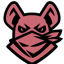 | 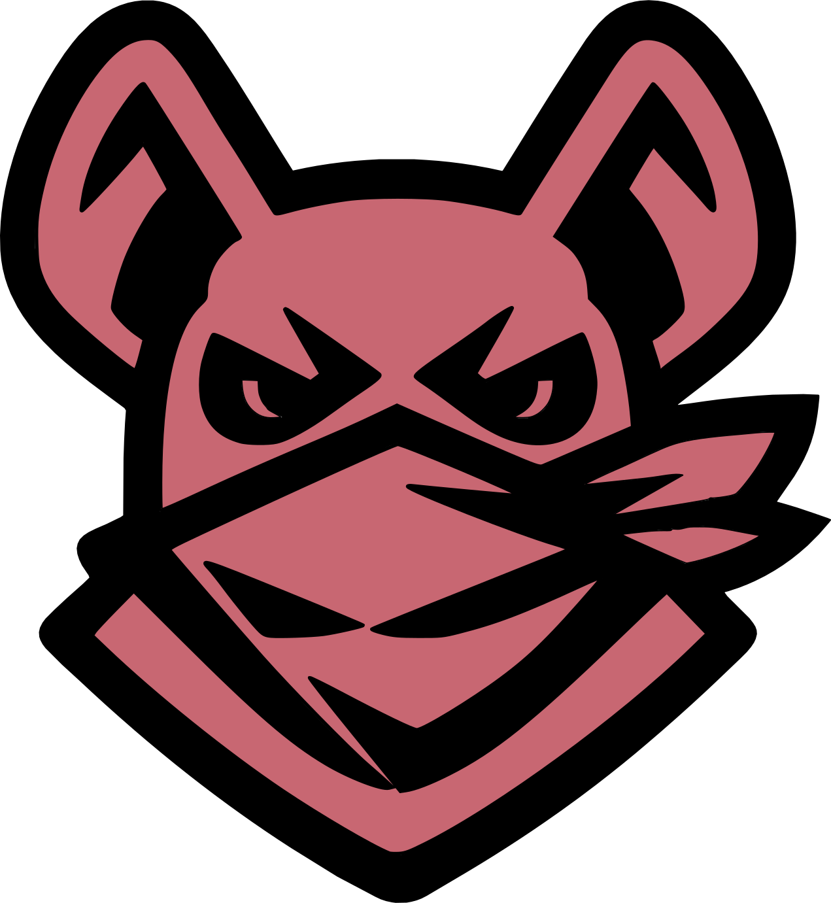 |
| Berserker |  | 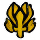 | 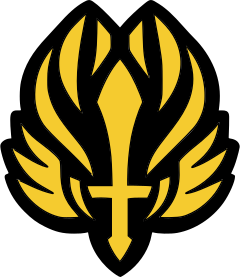 |
| Bladesworn |  | 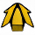 | 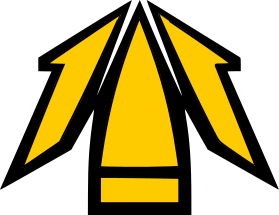 |
| Catalyst |  |  | 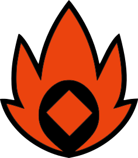 |
| Chronomancer |  | 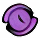 |  |
| Conduit |  | 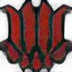 | 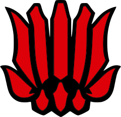 |
| Daredevil |  | 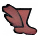 | 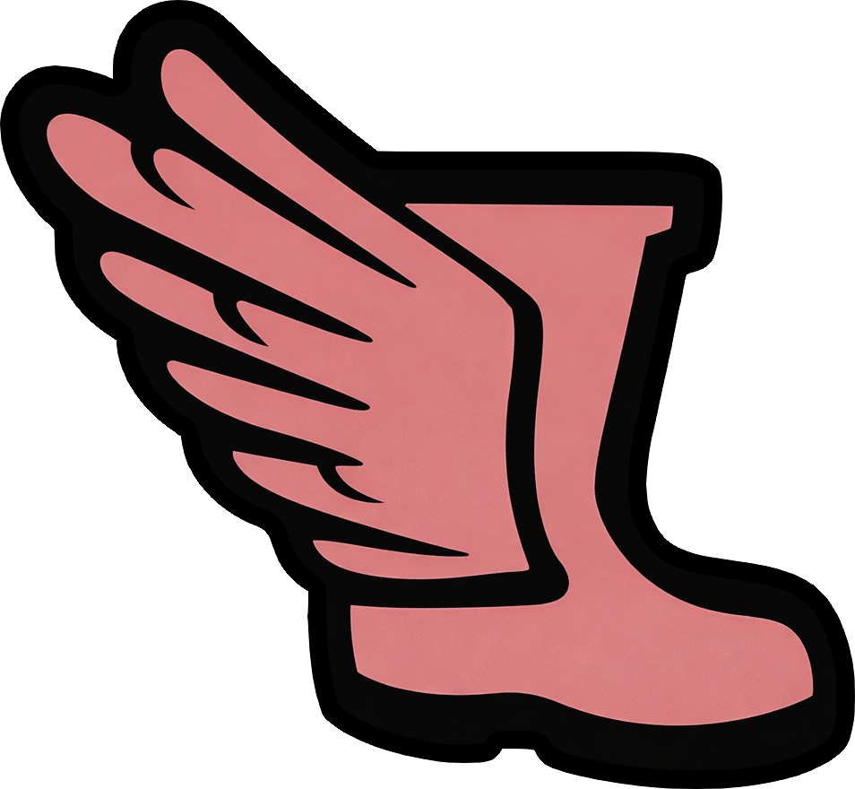 |
| Deadeye |  | 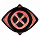 | 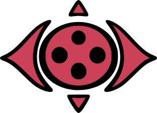 |
| Dragonhunter |  | 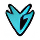 | 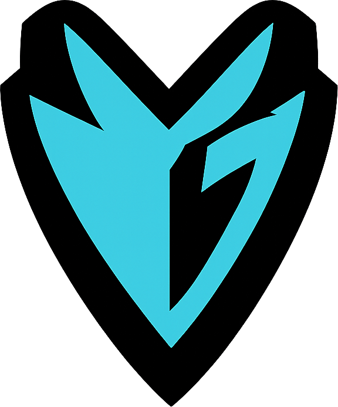 |
| Druid |  | 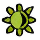 |  |
| Elementalist |  |  | 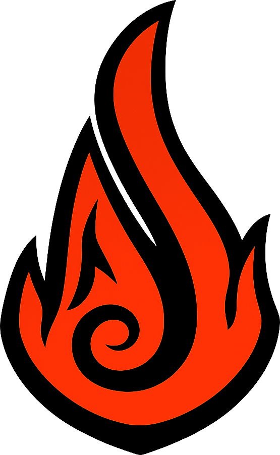 |
| Engineer |  | 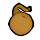 | 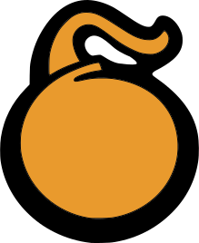 |
| Evoker |  | 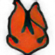 | 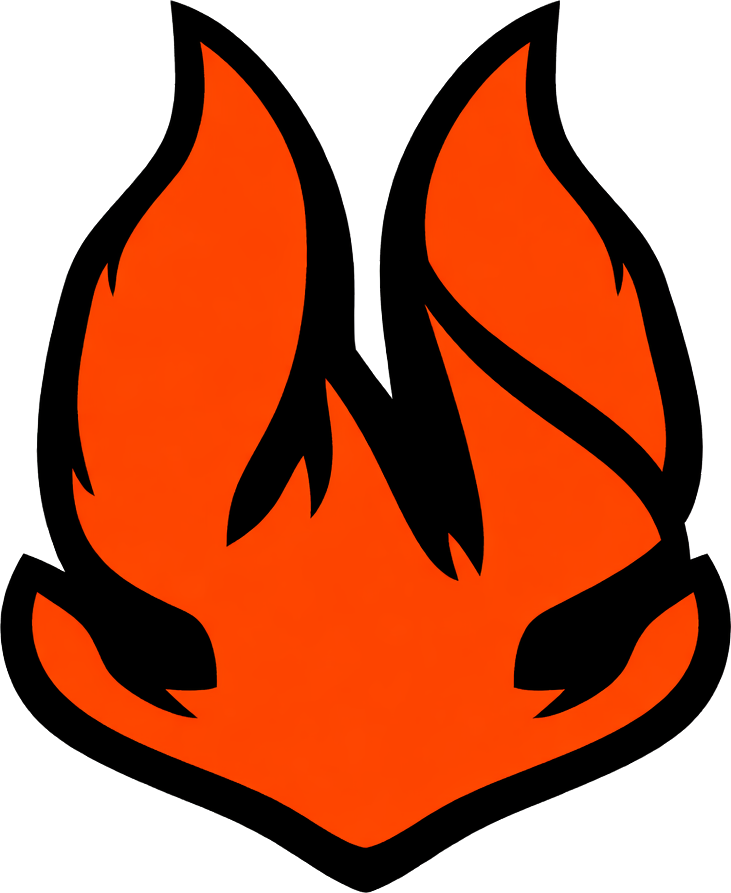 |
| Firebrand |  | 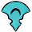 | 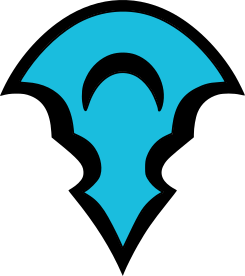 |
| Galeshot |  | 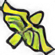 |  |
| Guardian |  | 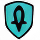 | 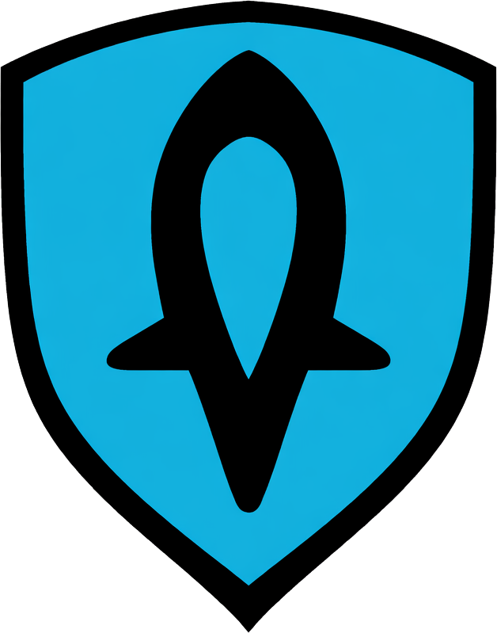 |
| Harbinger |  |  |  |
| Herald |  | 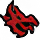 | 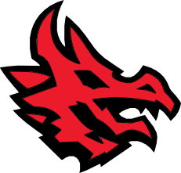 |
| Holosmith |  |  |  |
| Luminary |  |  |  |
| Mechanist |  | 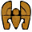 | 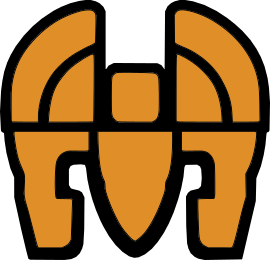 |
| Mesmer |  | 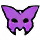 | 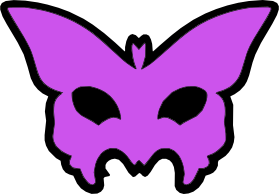 |
| Mirage |  | 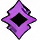 | 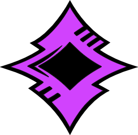 |
| Necromancer |  | 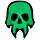 |  |
| Paragon |  | 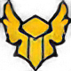 | 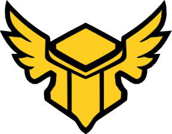 |
| Ranger |  |  |  |
| Reaper |  | 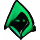 | 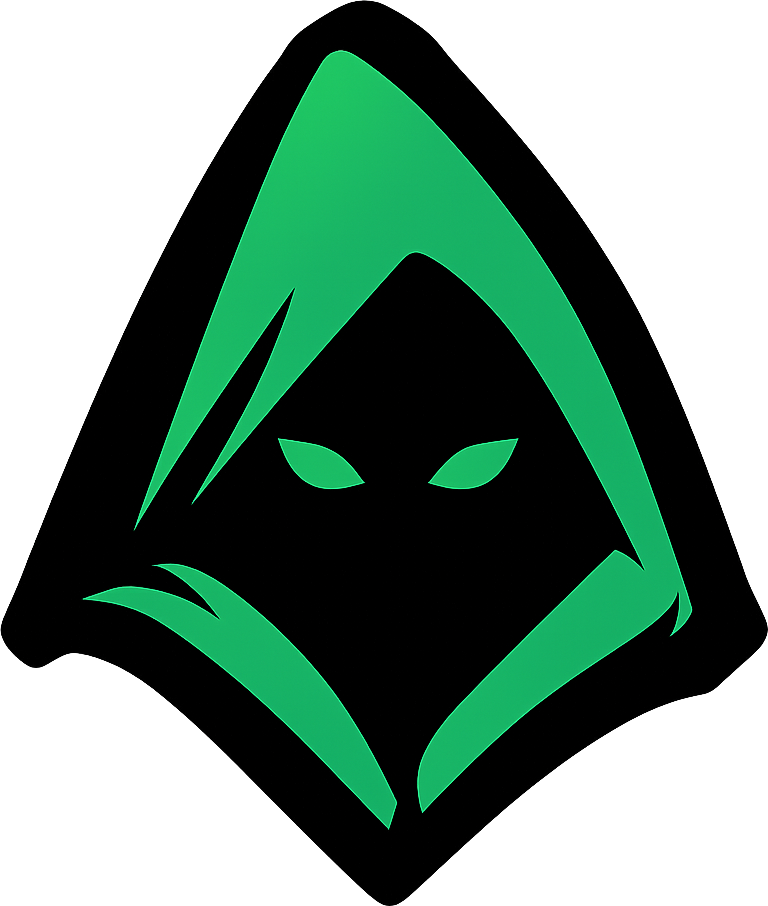 |
| Renegade |  |  | 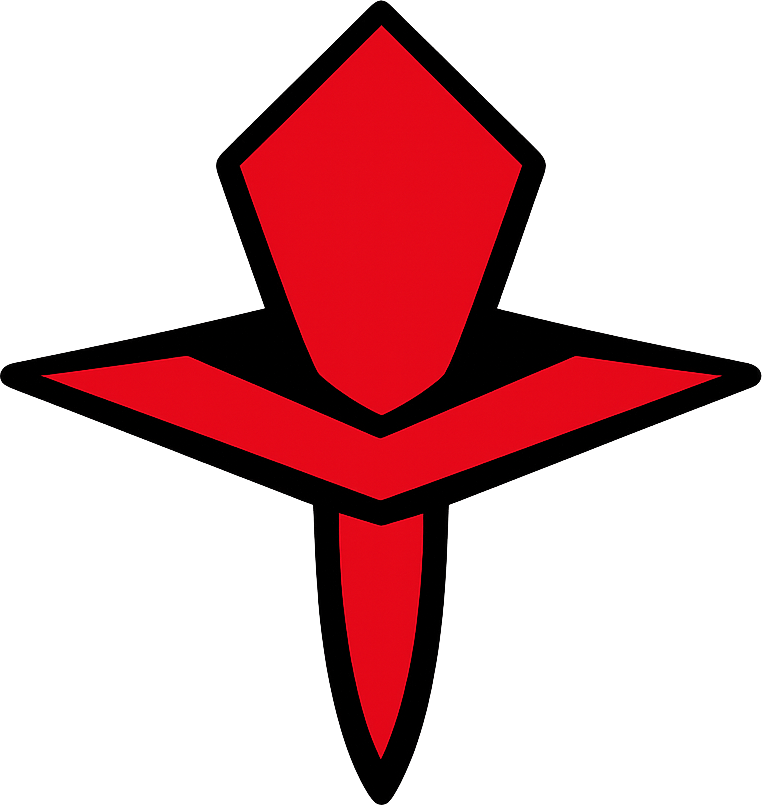 |
| Revenant |  | 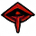 | 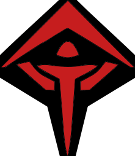 |
| Ritualist |  | 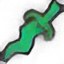 | 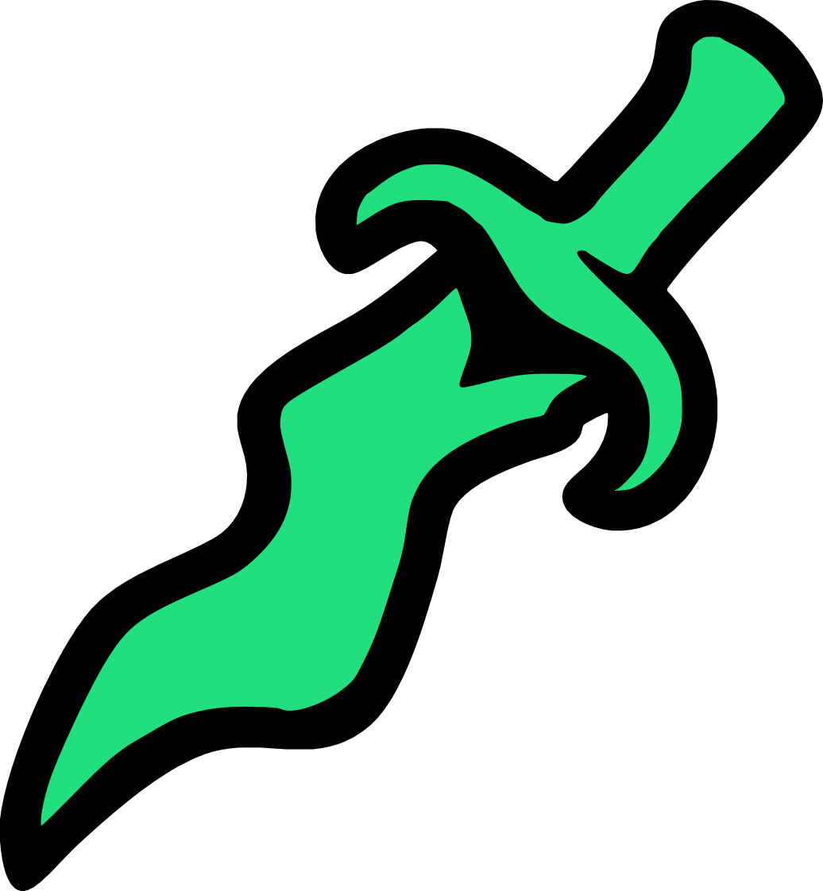 |
| Scourge |  |  | 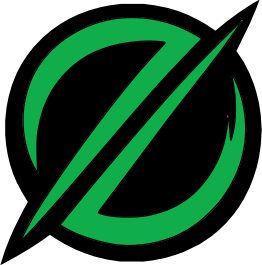 |
| Scrapper |  |  |  |
| Soulbeast |  |  |  |
| Specter |  | 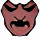 | 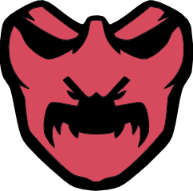 |
| Spellbreaker |  | 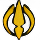 | 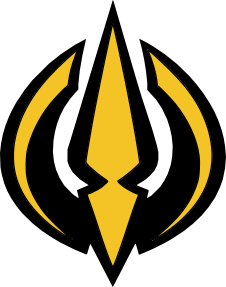 |
| Tempest |  |  |  |
| Thief |  |  |  |
| Troubadour |  |  |  |
| Untamed |  |  |  |
| Vindicator |  |  |  |
| Virtuoso |  |  |  |
| Warrior |  |  |  |
| Weaver |  |  |  |
| Willbender |  |  |  |
